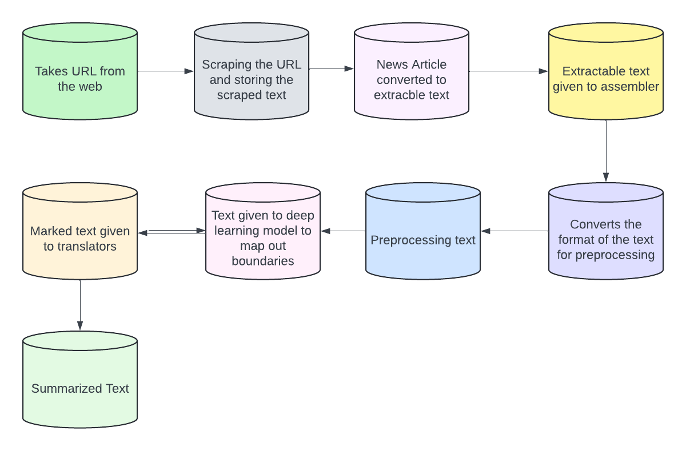
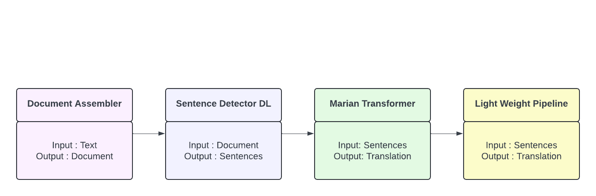
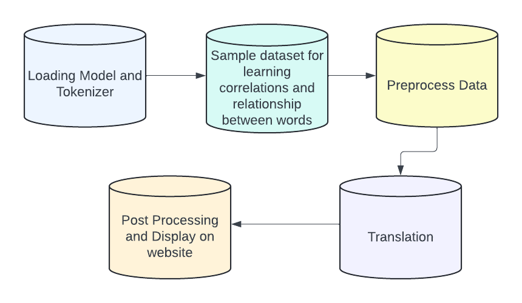

# ARTEN
This repo contains all the code for Arabic news summarization and translation to English 
-----------
Notebooks included in the repository:
1. Summarization Marian - This shows the steps taken to implement the SparkNLP Pipeline + Facebook BART Summarization model on a Flask app
2. Translation Marian - This shows steps taken to implement the SparkNLP Pipeline specifically for AR-EN translation
3. Bleu Score Calculation - This shows the steps for using BLEU score to evaluate model accuracy
4. Translation T5 - This shows the steps taken to implement the T5 model for AR-EN translation
5. ARTEN - This shows the combination of the translation feature + webpage scraping + summarization feature into the finalized Flask app

## Summarization Process 

## Translation Marian Process 

## Translation T5 Process 

------------

This repository is for the purposes of final project completion from the BUiD module "CSAI-401 Advanced Natural Language Processing (ANLP)".
